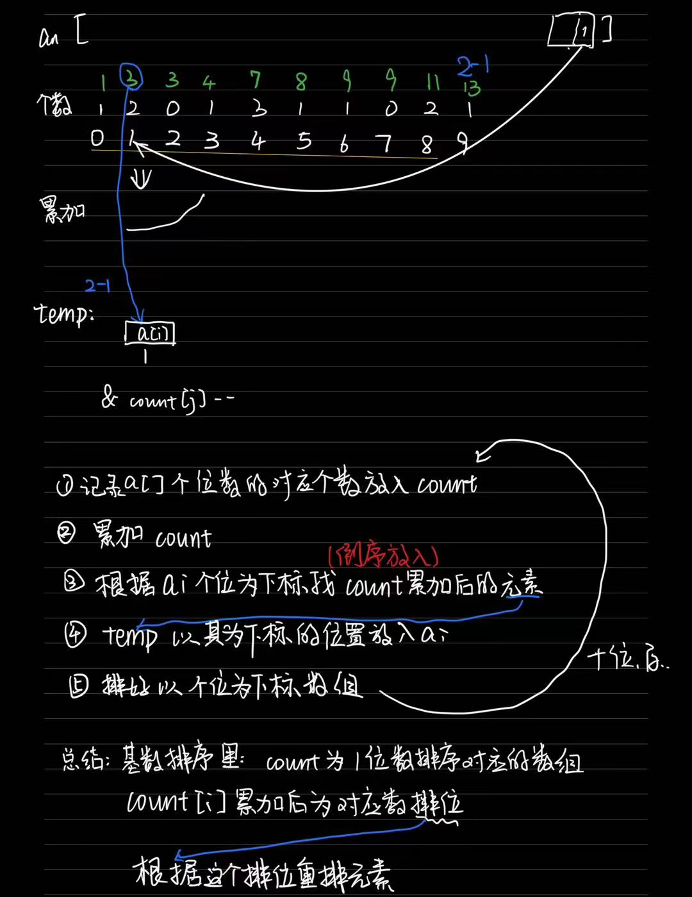

# QG训练营嵌入式组第三周周记：

2023年4月1日

## 生活随记

体测考完浑身酸痛。。。

下周还要靠高数

还有团队project...    所以时间管理真的很重要！！！

还有这周5答辩意识到在项目中花多一些时间做ppt和文档也很重要。。

而且答辩中最重要的是**展现结果**，一切以展示出结果为重！！写项目的优先级也是这样

## 一周总结

**插入排序：** *O(n²)* ,选一个**基准元素i**，向前遍历直到大小合适，放下i对应的元素，重复直至遍历完毕

**归并排序：** *O(logn)* ,将一个数组递归拆分至最小单元，再排序交换放回

**快速排序：** *O(nlogn) or O(n²)* ,**选基准**，小于基准的放左边，大于放右边。然后**分而治之**2分递归...

**计数排序：** O(n)，**创建count数组大小大于排序数组的最大值**，然后按照**数组元素大小**放在对应的新数组**下标**的位置上，并记录对应元素的个数。然后**遍历count释放**，将**count下标按顺序赋值给排序数组并free(count)**

**基数排序：** 

**颜色排序：** 与基数排序基本一样只是改成了4进制，count长度固定为3

## 存在问题

PPT和项目文档时间安排的不够

## 下周规划

复习高数

建群沟通团队项目
